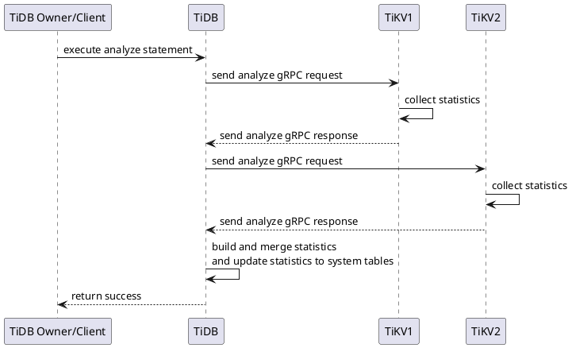
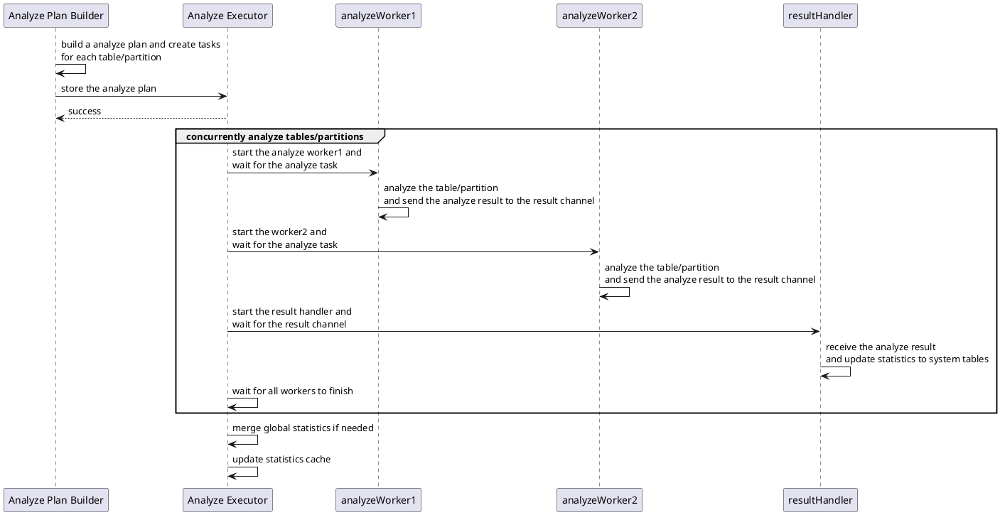
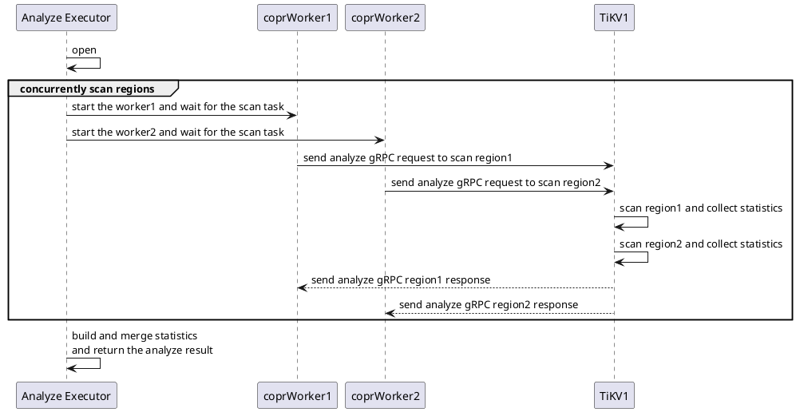
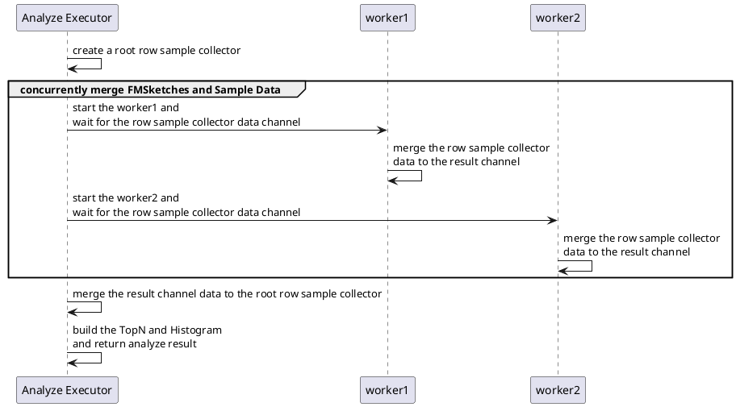
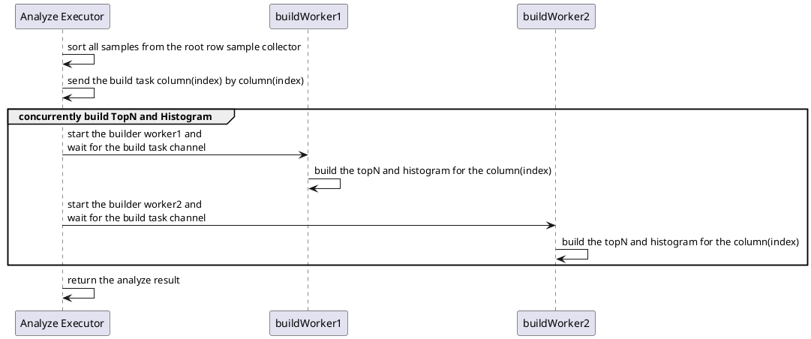
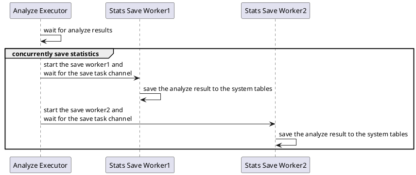
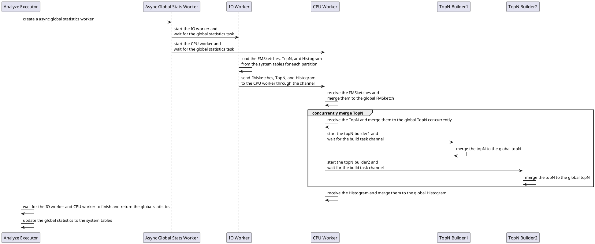

# TiDB Analyze

A Deep Dive

Based on TiDB [v8.1.0](https://github.com/pingcap/tidb/tree/v8.1.0)

RUSTIN LIU

<div class="pt-12">
  <span @click="$slidev.nav.next" class="px-2 py-1 rounded cursor-pointer" hover="bg-white bg-opacity-10">
    Press Space to Start
  </span>
</div>


<div class="abs-br m-6 flex gap-2">
  <button @click="$slidev.nav.openInEditor()" title="Open in Editor" class="text-xl slidev-icon-btn opacity-50 !border-none !hover:text-white">
    <carbon:edit />
  </button>
  <a href="https://github.com/slidevjs/slidev" target="_blank" alt="GitHub" title="Open in GitHub"
    class="text-xl slidev-icon-btn opacity-50 !border-none !hover:text-white">
    <carbon-logo-github />
  </a>
</div>

<!---
Thanks for joining me today. I'm Rustin, today I'm gonna talk about TiDB Analyze.
TiDB Analyze is a feature that collects statistics for the optimizer to generate better query plans.
If you want to take a look at the source code, you need to go to the TiDB repository and check out the v8.1.0 tag.
All my examples and algorithms are based on this version.
Alright, let's get started.
-->

---
transition: slide-up
---

# Rustin Liu

<div class="leading-8 opacity-80">
PingCAP Database Engineer.<br/>
Cargo/Crates.io/Rustup Maintainer.<br/>
Tokio Console Maintainer.<br/>
</div>

<div my-10 grid="~ cols-[40px_1fr] gap-y4" items-center justify-center>
  <div i-ri-github-line op50 ma text-xl/>
  <div><a href="https://github.com/hi-rustin" target="_blank">hi-rustin</a></div>
  <div i-ri-firefox-line op50 ma text-xl/>
  <div><a href="https://hi-rustin.rs" target="_blank">hi-rustin.rs</a></div>
</div>


<div flex="~ gap2">
</div>

<!---
First, let me introduce myself. I'm Rustin Liu, a Database Engineer at PingCAP.
I'm also pretty active in the Rust community. So, if you have any questions about the Rust toolchain, feel free to ask me.
-->

---
transition: slide-up
layout: center
---

<div text-6xl fw100>
  Agenda
</div>

<br>

<div class="grid grid-cols-[3fr_2fr] gap-4">
  <div class="border-l border-gray-400 border-opacity-25 !all:leading-12 !all:list-none my-auto">

  - Analyze Overview
  - Data Structure Overview
  - Data Flow Overview
  - Data Structure & Data Flow (TiKV Perspective)
  - Data Structure & Data Flow (TiDB Perspective)
  - Q&A

  </div>
</div>

<!---

This is the agenda for today's talk.
We will start with an overview of the Analyze feature.
Then we will dive into the data structure and data flow overview.
We will look at the data structure and data flow from both the TiKV and TiDB perspectives.
Finally, we will have a Q&A session.

-->

---
transition: slide-left
layout: center
---

# Analyze Overview

---
transition: slide-left
layout: default
---

# Analyze Statement


<!---

Alright, let’s break down the basic syntax of the Analyze statement.

First off, you can analyze different parts of your database: tables, partitions, columns, and indexes.

You also have the option to focus only on predicate columns. This means it will analyze the columns used in the where clause of your queries.

Plus, you can tweak a few settings, like specifying the number of top N items or the number of buckets.

Now, let’s dive into some examples to see how it works.

-->


---
transition: slide-left
---

# Analyze Statement


```sql{all|1-2|4-5|7-8|10-11|13-14|16-17|19-20|22-23}
-- Analyze Tables
ANALYZE TABLE t1, t2;

-- Analyze Partitions
ANALYZE TABLE t PARTITION p1, p2;

-- Analyze Columns
ANALYZE TABLE t COLUMNS c1, c2;

-- Analyze Indexes
ANALYZE TABLE t INDEX idx1, idx2;

-- Analyze Partitions' Columns
ANALYZE TABLE t PARTITION p1 COLUMNS c1, c2;

-- Analyze Partitions' Indexes
ANALYZE TABLE t PARTITION p1 INDEX idx1, idx2;

-- Analyze Predicate Columns
ANALYZE TABLE t PREDICATE COLUMNS;

-- Analyze With Only 20 Top N
ANALYZE TABLE t COLUMNS c1, c2 WITH 20 TOPN;
```

---
transition: slide-up
layout: center
---

# Data Structure Overview

<!---

After executing the Analyze statement, we’ll generate some statistics.

In this section, we’ll examine the data structure used to store these statistics.

-->

---
transition: slide-left
---

# Data Structure Overview
A simple example.

Create table
```sql{all|2}
use test;
create table t (a int);
```
Insert 2000 rows
```ts{all|6-9}
import { Client } from "https://deno.land/x/mysql/mod.ts";

const client = await new Client().connect({...});

for (let i = 0; i < 2000; i++) {
  await client.execute(`INSERT INTO t (a) VALUES (?)`, [i]);
  if (i % 2 === 0) {
    await client.execute(`INSERT INTO t (a) VALUES (?)`, [i]);
  }
}

await client.close();
```

<!---

Let’s start with a simple example.

First, we’ll create a table named t with a single column a.

Next, we’ll insert 2000 rows into the table.

Notice that we insert the same value twice for every even number.

Keep this example in mind, as we’ll use it later to illustrate the data structure.

-->


---
transition: slide-left
---

# Data Structure Overview
Column Selectivity

```sql
explain select * from t where a = 100;
```

| id                 | estRows                                                                              | task        | access object | operator info       |
| :----------------- | :----------------------------------------------------------------------------------- | :---------- | :------------ | :------------------ |
| TableReader\_7     | 2.00                                                                                 | root        |               | data:Selection\_6   |
| └─Selection\_6     | <span class="text-green-500" v-mark="{ color: 'green', type: 'circle' }">2.00</span> | cop\[tikv\] |               | eq\(test.t.a, 100\) |
| └─TableFullScan\_5 | 3000.00                                                                              | cop\[tikv\] | table:t       | keep order:false    |

<br/>

```go{all|2}
func equalRowCountOnColumn(encodedVal []byte...) {
  rowcount, ok := c.TopN.QueryTopN(sctx, encodedVal)
	if ok {
		return float64(rowcount), nil
	}
}
```

<!---

Let’s look at a simple query that selects rows where column A equals 100.

This is a basic example of column selectivity, using a simple equality condition. The optimizer estimates that there are 2 rows that match this condition.

The optimizer uses the TopN data structure to make this estimate.

The value 100 is in the TopN data structure, because it’s an even number and we inserted it twice.

-->

---
transition: slide-left
---

# Data Structure Overview
Column Selectivity

TopN

```sql
select * from mysql.stats_top_n order by value limit 5;
```

| table\_id | is\_index | hist\_id | value                                                                                                                                                                             | count |
| :-------- | :-------- | :------- | :-------------------------------------------------------------------------------------------------------------------------------------------------------------------------------- | :---- |
| 106       | 0         | 1        | <span class="text-green-500" v-mark="{ color: 'green', type: 'circle' }">0x038</span>00000000000<span class="text-red-500" v-mark="{ color: 'red', type: 'circle' }" >0000</span> | 2     |
| 106       | 0         | 1        | 0x038000800000000002                                                                                                                                                              | 2     |
| 106       | 0         | 1        | 0x038000800000000004                                                                                                                                                              | 2     |
| 106       | 0         | 1        | 0x038000800000000006                                                                                                                                                              | 2     |
| 106       | 0         | 1        | 0x038000800000000008                                                                                                                                                              | 2     |


<!---

We use a system table called stats_top_n to store the TopN data structure.

If we query this table, we can see the top N values and their counts.

For example, we can see that the value 0x0380000000000000 is in the TopN data structure with a count of 2.

The 0x038 indicates that the value is an integer.

In this example, the data skew isn’t very high, so all values have the same count.

-->


---
transition: slide-left
---

# Data Structure Overview
Column Selectivity

```sql
explain select * from t where a = 1999;
```

| id                 | estRows                                                                          | task        | access object | operator info        |
| :----------------- | :------------------------------------------------------------------------------- | :---------- | :------------ | :------------------- |
| TableReader\_7     | 1.00                                                                             | root        |               | data:Selection\_6    |
| └─Selection\_6     | <span class="text-red-500" v-mark="{ color: 'red', type: 'circle' }">1.00</span> | cop\[tikv\] |               | eq\(test.t.a, 1999\) |
| └─TableFullScan\_5 | 3000.00                                                                          | cop\[tikv\] | table:t       | keep order:false     |

<br/>

```go{all|2,3,4}
func equalRowCountOnColumn(encodedVal []byte...) {
	histCnt, matched := c.Histogram.EqualRowCount(sctx, val, true)
	if matched {
		return histCnt, nil
	}
}
```

<!---

Now, let’s look at another example.

This time, we’re selecting rows where column a equals 1999.

Since we only collect the first top 500/100 values, the value 1999 isn’t in the TopN data structure.

In this case, the optimizer uses the Histogram data structure to estimate the number of matching rows.

The Histogram data structure shows the distribution of values in the column. By analyzing the histogram, the optimizer can estimate how many rows meet the condition.

So, in this example, the optimizer estimates that only 1 row matches the condition.

-->

---
transition: slide-left
---

# Data Structure Overview
Column Selectivity

```sql
select hist_id, bucket_id, count, repeats,
       CAST(lower_bound AS SIGNED) AS lower_bound,
       CAST(upper_bound AS SIGNED) AS upper_bound,
       ndv
from mysql.stats_buckets order by lower_bound desc limit 5;
```

| hist\_id | bucket\_id | count                                                                         | repeats                                                                       | lower\_bound                                                                     | upper\_bound                                                                     | ndv  |
| :------- | :--------- | :---------------------------------------------------------------------------- | :---------------------------------------------------------------------------- | :------------------------------------------------------------------------------- | :------------------------------------------------------------------------------- | :--- |
| 1        | 229        | 1                                                                             | 1                                                                             | 1999                                                                             | 1999                                                                             | 0    |
| 1        | 228        | <span class="text-red-500" v-mark="{ color: 'red', type: 'circle' }">9</span> | <span class="text-red-500" v-mark="{ color: 'red', type: 'circle' }">2</span> | <span class="text-red-500" v-mark="{ color: 'red', type: 'circle' }">1993</span> | <span class="text-red-500" v-mark="{ color: 'red', type: 'circle' }">1998</span> | 0    |
| 1        | 227        | 9                                                                             | 2                                                                             | 1987                                                                             | 1992                                                                             | 0    |
| 1        | 226        | 9                                                                             | 2                                                                             | 1981                                                                             | 1986                                                                             | 0    |
| 1        | 225        | 9                                                                             | 2                                                                             | 1975                                                                             | 1980                                                                             | 0    |


<!---

We use a system table called stats_buckets to store the Histogram data structure.

If we query this table, we can see the histogram buckets.

In this example, we can see that the value 1999 is in a histogram bucket with a count of 1.

The lower and upper bounds of this bucket are both 1999.

If we look at the previous bucket, we see it has a count of 9, with a lower bound of 1993.

Additionally, the repeats are 2, meaning there are two repeated values of the upper bound.

We can use this repeated value to estimate the selectivity of the column for an equality condition. Is is kind of like a special TopN in the histogram.

-->


---
transition: slide-left
---
# Data Structure Overview
Histogram Bucket

- Bucket ID: The bucket ID of the histogram.
- Count: The number of values till the bucket.(**cumulative**)
- Repeats: The number of repeated values at the upper bound.
- Lower Bound: The lower bound of the bucket.
- Upper Bound: The upper bound of the bucket.
- NDV: The number of distinct values in the bucket.

````md magic-move
```json
{
    "bucket_id": 228,
    "count": 9,
    "repeats": 2,
    "lower_bound": 1993,
    "upper_bound": 1998,
    "ndv": 0
}
```


```json
{
    "bucket_id": 228,
    "count": [1993, 1994, 1994, 1995, 1996, 1996, 1997, 1998, 1998],
    "repeats": [1998, 1998],
}
```
````

<!---

Let’s take a closer look at the histogram bucket.

Bucket ID: The ID of the histogram bucket.

Count: The number of values in the bucket. This is a cumulative count, including all values up to the bucket.

Repeats: The number of repeated values at the upper bound.

Lower Bound: The lower bound of the bucket.

Upper Bound: The upper bound of the bucket.

NDV (Number of Distinct Values): The number of distinct values in the bucket.

In this example, we have a bucket with an ID of 228. The count is 9, and the repeats are 2. The lower bound is 1993, and the upper bound is 1998.

If we break down the count and repeats, we can see the individual values within the bucket.

-->

---
transition: slide-left
---


# Data Structure [^1]


<Histogram className="histogram"/>

[^1]: [Piatetsky-Shapiro, Gregory, and Charles Connell. "Accurate Estimation Of The Number Of Tuples Satisfying A Condition"](https://dl.acm.org/doi/pdf/10.1145/971697.602294)

<style>
.histogram {
  height: 80%;
}
.footnotes-sep {
  margin-top: 1em;
}
.footnote-item{
  font-size: 0.5em;
}
.footnote-backref {
  display: none
}
</style>

<!---

As you can see, we use a equi-height histogram to store the data.

The reason we use an equi-height histogram is that it provides a more accurate estimation of the selectivity of the column.

You can find more at this paper.

-->

---
transition: slide-left
---

# Data Structure Overview
Column Selectivity

```sql
explain select * from t where a = 9999;
```

| id                 | estRows                                                                          | task        | access object | operator info        |
| :----------------- | :------------------------------------------------------------------------------- | :---------- | :------------ | :------------------- |
| TableReader\_7     | 1.33                                                                             | root        |               | data:Selection\_6    |
| └─Selection\_6     | <span class="text-red-500" v-mark="{ color: 'red', type: 'circle' }">1.33</span> | cop\[tikv\] |               | eq\(test.t.a, 2000\) |
| └─TableFullScan\_5 | 3000.00                                                                          | cop\[tikv\] | table:t       | keep order:false     |

<br/>

```go{all|2,6}
func equalRowCountOnColumn(encodedVal []byte...) {
	histNDV := float64(c.Histogram.NDV - int64(c.TopN.Num()))
	if histNDV <= 0 {
		return 0, nil
	}
	return c.Histogram.NotNullCount() / histNDV, nil
}
```

<!---

Now, let’s look at another example.

This time, we’re selecting rows where column a equals 9999. Since the value 9999 isn’t in the TopN data structure or the Histogram data structure, the optimizer uses a different method to estimate the number of matching rows.

In this case, the optimizer estimates that 1.33 rows match the condition.

The optimizer uses the NotNullCount and NDV from the Histogram data structure to make this estimate.

-->

---
transition: slide-left
---

# Data Structure Overview
Column Selectivity

- Not Null Count: The number of not null values in the column.
- NDV: The number of distinct values in the column.

<br/>

### How to calculate the NDV(Non-Distinct Value)?

We use [FMSketch(Flajolet-Martin Sketch)](https://en.wikipedia.org/wiki/Flajolet%E2%80%93Martin_algorithm) to calculate the NDV.


<!---

The NotNullCount is the number of not null values in the column. The NDV (Number of Distinct Values) is the number of distinct values in the column.

To calculate the NDV, we use the Flajolet-Martin Sketch algorithm. This algorithm provides an efficient way to estimate the number of distinct values in a set.

Before we dive into the details of the algorithm, let’s take a look at the data flow from the TiKV perspective.

-->

---
transition: slide-up
layout: center
---

# Data Flow Overview

---
transition: slide-left
---

# Data Flow Overview




<!---

This is the data flow overview of the Analyze feature.

First, the TiDB owner or client executes the Analyze statement.

Next, TiDB sends an analyze gRPC request to TiKV to collect statistics.

After collecting the statistics, TiKV sends an analyze gRPC response back to TiDB.

Finally, TiDB builds and merges the statistics and updates the system tables.

We use the same coprocessor framework to collect statistics as we do for executing queries. This is a special request handled by the coprocessor.

I won’t go into the details of the coprocessor framework in this talk, but you can find more information in the TiKV repository.

-->

---
transition: slide-up
layout: center
---

# Data Structure & Data Flow
TiKV Perspective

In TiKV, we only do two things:

1. Calculate the FMSketch.
2. Sample the data.

<!---

In TiKV, we only do two things:

1.	Calculate the FMSketch: We scan all the data and calculate the FMSketch to estimate the NDV. Note that this is the most expensive part of the process.
2.	Sample the data: We cannot send all the data to TiDB, so we need to sample it.

-->


---
transition: slide-left
---

# Data Structure - FMSketch
TiKV Perspective

Mathematical Assumptions [^1]
1. **Independence of Hash Functions**:
   - Assume a good hash function **h(x)** that uniformly distributes input elements over a large range of integers.
2. **Expectation of Trailing Zeros in Hash Values**:
   - For uniformly distributed hash values, the number of trailing zeros in their binary representation follows a geometric distribution.

[^1]: [Flajolet, Philippe; Martin, G. Nigel (1985). "Probabilistic counting algorithms for data base applications"](https://algo.inria.fr/flajolet/Publications/FlMa85.pdf)

<style>
.footnotes-sep {
  margin-top: 1em;
}
.footnote-item{
  font-size: 0.5em;
}
.footnote-backref {
  display: none
}
</style>

<!---

Before we dive into the details of the FMSketch implementation, let’s look at the mathematical assumptions.

First, we assume that the hash functions are independent. This means that the hash function h(x) uniformly distributes input elements over a large range of integers.

Second, we assume that the number of trailing zeros in the binary representation of the hash values follows a geometric distribution.

These assumptions are crucial for the accuracy of the FMSketch.

If you want to learn more about the FMSketch algorithm, you can find the original paper in the footnotes.

-->

---
transition: slide-left
---

# Data Structure - FMSketch
TiKV Perspective

Algorithm Principles
1. **Hash Mapping**:
   - Map each element of the set to an integer using the hash function h(x).
2. **Trailing Zeros Counting**:
   - For each hash value, count the number of trailing zeros in its binary representation. Record the maximum count **R**.
3. **Cardinality Estimation**:
   - Use the maximum trailing zero count **R** to estimate the cardinality of the set with the formula $2^R$.

---
transition: slide-left
---

# Data Structure - FMSketch
TiKV Perspective

Example
- Given a set $\{a, b, c\}$
- Hash values $h(a) = 8$, $h(b) = 12$, $h(c) = 5$
- Binary representations: $1000$, $1100$, $0101$
- Trailing zeros: $3$, $2$, $0$
- Maximum trailing zeros $R = 3$
- Estimated cardinality: $2^3 = 8$

<!---

Let’s look at an example to illustrate the FMSketch algorithm.

Suppose we have a set with three elements: a, b, and c.

We hash each element using the hash function h(x) and get the hash values 8, 12, and 5.

The binary representations of these hash values are 1000, 1100, and 0101.

The number of trailing zeros in these binary representations are 3, 2, and 0.

The maximum trailing zero count is 3.

Using the formula 2^R, we estimate the cardinality of the set as 8.

-->

---
transition: slide-left
---

<FMSketch/>

<!---
This is a more detailed example of the FMSketch algorithm.

Click the generate button to see the hash values and trailing zeros for each element.

You’ll see that the maximum trailing zero count is 4, and the estimated cardinality is 16.

This is a perfect example, as the estimated cardinality matches the actual cardinality of the set.

However, in practice, there will be some cases where the estimation is not as accurate.
-->

---
transition: slide-left
---

<BadFMSketch/>

<!---

This time, we have an outlier in the set.

The hash value of the outlier is jj, which has 6 trailing zeros.

The maximum trailing zero count is 6, and the estimated cardinality is 64.

But the actual cardinality of the set is 16.

This is an example where the FMSketch algorithm doesn’t provide an accurate estimation.

To address this issue, we need to use multiple hash functions and take the median estimate.

However, using multiple hash functions increases the computational cost. So, we chose another algorithm called Distinct Sampling to solve this problem.

-->


---
transition: slide-left
---

# Data Structure - Distinct Sampling
TiKV Perspective

Core Principles [^1]
1. **Hash Function:**
   - Use a hash function that maps each distinct value to a random `die-level`.
2. **Sample Maintenance:**
   - Maintain a sample S of distinct values and a current level `l`.
3. **Sampling Criterion:**
   - Keep values in S only if their `die-level ≥ l`.
4. **Cardinality Estimation:**
   - Estimate distinct items as $|S| * 2^l$

[^1]: [Phillip B. Gibbons. "Distinct Sampling for Highly-Accurate Answers
to Distinct Values Queries and Event Reports"](https://www.vldb.org/conf/2001/P541.pdf)

<style>
.footnotes-sep {
  margin-top: 1em;
}
.footnote-item{
  font-size: 0.5em;
}
.footnote-backref {
  display: none
}
</style>

<!---

To address the limitations of the FMSketch algorithm, we use a new algorithm called Distinct Sampling.

The core principles of Distinct Sampling are as follows:

	1.	Hash Function: Use a hash function that maps each distinct value to a random die-level. This is very similar to the FMSketch algorithm.
	2.	Sample Maintenance: Maintain a sample S of distinct values and a current level l.
	3.	Sampling Criterion: Keep values in S only if their die-level is greater than or equal to l.
	4.	Cardinality Estimation: Estimate the number of distinct items as the size of the sample S multiplied by 2^l.

The way we determine the die-level is similar to the FMSketch algorithm. We use a hash function to map each distinct value to a random value and check its binary representation to determine the die-level. If there are no trailing zeros, the die-level is 0. If there is one trailing zero, the die-level is 1, and so on.

-->

---
transition: slide-left
---

# Data Structure - Distinct Sampling
TiKV Perspective

Algorithm Steps
1. **Initialization:**
   - Start with l = 0 and an empty sample S.
2. **Processing Each Row:**
   - For each row r with target attribute value v:
     - Compute die-level = $h(v)$
     - If die-level ≥ l:
       - Add r to S
3. **Sample Size Control:**
   - If $|S| > k$, increment l and remove items with die-level < l.

<!---

The Distinct Sampling algorithm consists of three main steps:

	1. Initialization
	  •	Start with l = 0 and an empty sample S.
	2. Processing Each Row
	  •	For each row r with the target attribute value v:
	  •	Compute the die-level using the hash function h(v).
	  •	If the die-level is greater than or equal to l, add r to the sample S.
	3. Sample Size Control
	  •	If the size of the sample S is greater than k, increment l and remove items with a die-level less than l.

-->

---
transition: slide-left
---

<FMSketchDemo/>

<!---

This is a more detailed example of the Distinct Sampling algorithm.

We can use it to illustrate the algorithm steps.

Every time you click the “Next” button, we will process a new row.

The sample size is set to 8, so we will increment the die-level when the sample size exceeds 8.

As you can see, even with an outlier in the set, the estimated cardinality remains accurate.

-->


---
transition: slide-left
---

# Data Structure - Distinct Sampling
TiKV Perspective

Estimation and Analysis

1. **Cardinality Estimation:**
   - Estimate distinct items as $|S| * 2^l$
2. **Accuracy:**
   - Provides estimates within 0%-10% relative error
   - Much more accurate than previous sampling methods
3. **Efficiency:**
   - Single pass over the data.
   - Only one hash function required.

<!---

The Distinct Sampling algorithm provides a more accurate estimation of the number of distinct items in a set.

The cardinality estimation is calculated as the size of the sample S multiplied by 2^l.

The algorithm provides estimates within a 0% to 10% relative error, making it much more accurate than previous sampling methods.

The algorithm is also efficient, as it only requires a single pass over the data and one hash function.

-->


---
transition: slide-left
---

# Data Structure - Bernoulli Sampling
General Perspective

Mathematical Assumptions
1. **Independence of Sample Selection**:
   - Each sample in the data set is selected independently from other samples.
2. **Uniform Sampling Probability**:
   - Each sample is selected with a fixed probability $p(0 ≤ p ≤ 1)$, uniformly across the entire data set.
3. **Bernoulli Distribution**:
   - Each sample selection follows a Bernoulli distribution with parameter $p$.

<!---

The Bernoulli Sampling algorithm is the method used to sample data.

The algorithm is based on the following mathematical assumptions:

1. Independence of Sample Selection: Each sample in the data set is selected independently from other samples.
2. Uniform Sampling Probability: Each sample is selected with a fixed probability p (0 ≤ p ≤ 1), uniformly across the entire data set.
3. Bernoulli Distribution: Each sample selection follows a Bernoulli distribution with parameter p.

-->

---
transition: slide-left
---

# Data Structure - Bernoulli Sampling
General Perspective

Algorithm Principles
1. **Probability Definition**:
   - Define a sampling probability $p$ for selecting each sample.
2. **Independent Sampling**:
   - For each sample in the data set, generate a random number and compare it to $p$. If the random number is less than $p$, include the sample in the resulting subset.
3. **Subset Generation**:
   - The subset of samples selected using this method forms the result of the Bernoulli sampling.

<!---

The Bernoulli Sampling algorithm is based on the following principles:

1. Probability Definition: Define a sampling probability p for selecting each sample.
2. Independent Sampling: For each sample in the data set, generate a random number and compare it to p. If the random number is less than p, include the sample in the resulting subset.
3. Subset Generation: The subset of samples selected using this method forms the result of the Bernoulli sampling.

-->


---
transition: slide-left
---

<BernoulliSampling/>

<!---

This is a more detailed example of the Bernoulli Sampling algorithm.

Click the generate button to see the sample selection process.

It is pretty straightforward. We generate a random number for each sample and compare it to the sampling probability.

-->

---
transition: slide-up
layout: center
---

# Data Structure & Data Flow
TiDB Perspective

In TiDB, we do the following things:

1. Merge all FMSketches and Sample Data.
2. Build TopN and Histogram.
3. Update statistics to system tables.

<!---

After we calculate the FMSketches and sample the data in TiKV, we send the results back to TiDB.

In TiDB, we perform the following steps:

1. Merge all FMSketches and Sample Data.
2. Build the TopN and Histogram.
3. Store the statistics in the system tables.

-->

---
transition: slide-left
---

# Data Structure & Data Flow
Overview


<!---

We have already seen the data flow from the TiKV perspective.

Now, let’s look at the data flow from the TiDB perspective.

-->


---
transition: slide-up
---

### Nobody can really master TiDB analyze.jpg

<div style="font-size: 11px;">

| Configuration Name                                                                                                         | Description                                                                                                                                                                                                                                                                                                                                          | Default Value | Scope                                                                                                               | Affected Component   |
| :------------------------------------------------------------------------------------------------------------------------- | :--------------------------------------------------------------------------------------------------------------------------------------------------------------------------------------------------------------------------------------------------------------------------------------------------------------------------------------------------- | :------------ | :------------------------------------------------------------------------------------------------------------------ | :------------------- |
| <span class="text-red-500" v-mark="{ color: 'red', type: 'underline' }">tidb_build_stats_concurrency</span>                | The number of concurrent workers to analyze <span class="text-red-500" v-mark="{ color: 'red', type: 'underline' }">tables or partitions</span>                                                                                                                                                                                                      | 2             | Global/Session                                                                                                      | TiDB + TiKV          |
| <span class="text-red-500" v-mark="{ color: 'red', type: 'underline' }">tidb_auto_build_stats_concurrency</span>           | The number of concurrent workers to <span class="text-red-500" v-mark="{ color: 'red', type: 'underline' }">automatically analyze tables or partitions</span>                                                                                                                                                                                        | 1             | Global (only for auto analyze)                                                                                      | TiDB (Owner)  + TiKV |
| <span class="text-orange-500" v-mark="{ color: 'orange', type: 'underline' }">tidb_analyze_distsql_scan_concurrency</span> | The number of concurrent workers to <span class="text-orange-500" v-mark="{ color: 'orange', type: 'underline' }">scan regions</span>                                                                                                                                                                                                                | 4             | Global/Session                                                                                                      | TiKV                 |
| tidb_sysproc_scan_concurrency                                                                                              | The number of concurrent workers to scan regions                                                                                                                                                                                                                                                                                                     | 1             | <span class="text-orange-500" v-mark="{ color: 'orange', type: 'underline' }">Global (only for auto analyze)</span> | TiKV                 |
| <span class="text-purple-500" v-mark="{ color: 'purple', type: 'underline' }">tidb_build_sampling_stats_concurrency</span> | 1. The number of concurrent workers to <span class="text-purple-500" v-mark="{ color: 'purple', type: 'underline' }">merge FMSketches and Sample Data</span> from different regions <br/> <br/> 2. The number of concurrent workers to <span class="text-purple-500" v-mark="{ color: 'purple', type: 'underline' }">build TopN and Histogram</span> | 2             | Global/Session                                                                                                      | TiDB                 |
| <span class="text-green-500" v-mark="{ color: 'green', type: 'underline' }">tidb_analyze_partition_concurrency</span>      | The number of concurrent workers to <span class="text-green-500" v-mark="{ color: 'green', type: 'underline' }">save statistics to the system tables</span>                                                                                                                                                                                          | 2             | Global/Session                                                                                                      | TiDB                 |
| <span class="text-blue-500" v-mark="{ color: 'blue', type: 'underline' }">tidb_merge_partition_stats_concurrency </span>   | The number of concurrent workers to <span class="text-blue-500" v-mark="{ color: 'blue', type: 'underline' }">merge global TopN</span>                                                                                                                                                                                                               | 1             | Global/Session                                                                                                      | TiDB                 |

</div>


<!---

Before I start to show your all detailed process, I want to emphasize this module is really complex.

Here’s a quick rundown of the configuration settings that control how the Analyze feature runs concurrently in TiDB and TiKV.

I know it looks pretty complex, and I think there’s definitely room for improvement. Some names are so bad that nobody can really get a clear idea of what they do.

So don’t worry if you don’t understand everything right away. I’ll explain each configuration setting in detail. But even for me, it took a while to understand how everything works together.

So let’s dive into the details.

-->

---
transition: slide-left
---

# Data Structure & Data Flow
TiDB Perspective - Analyze tables or partitions concurrently



<div v-click class="absolute top-40 right-0 transform rotate-30 bg-red-500 text-white font-bold py-1 px-1 rounded-lg"> tidb_build_stats_concurrency </div>

<!---

This is the data flow for analyzing tables or partitions concurrently in TiDB.

We analyze tables or partitions concurrently to improve the performance of the Analyze feature. For partitioned tables, we may have many partitions, and analyzing them concurrently can significantly reduce the overall time.

Here’s how it works:

1. Build an Analyze Plan: Create tasks for each table or partition.
2. Start Analyze Workers: Begin the tasks and wait for their completion.
3. Update Statistics: Once the analysis is done, update the statistics in the system tables.
4. Merge Global Statistics (if needed): For partitioned tables, merge the statistics from each partition to obtain the global statistics.
5. Update Statistics Cache: Load the latest statistics into the cache to ensure the query optimizer uses the most up-to-date statistics.


The concurrency of the Analyze feature is controlled by the tidb_analyze_version variable. By default, the concurrency is set to 2.

-->

---
transition: slide-left
---

# Data Structure & Data Flow
TiDB Perspective - Scan regions concurrently



<div v-click class="absolute top-40 right-0 transform rotate-30 bg-red-500 text-white font-bold py-1 px-1 rounded-lg"> tidb_analyze_distsql_scan_concurrency </div>

<!---

Let’s dive into the details of the data flow for scanning regions concurrently in TiDB.

When we analyze a table, we need to scan all the regions in the table to collect statistics. To improve the performance of the Analyze feature, we scan regions concurrently. Here’s how it works:

1. Open the Analyze Executor: Initialize the analyze process.
2. Start the Coprocessor Workers: Begin the tasks and wait for their completion.
3. Scan Regions: Send an analyze gRPC request to each region to scan and collect statistics.
4. Build and Merge Statistics: Once the analysis is done, build and merge the statistics and return the analyze result.

To control the concurrency of scanning regions, you can adjust the tidb_analyze_distsql_scan_concurrency variable. By default, the concurrency is set to 4.

-->

---
transition: slide-left
---

# Data Structure & Data Flow
TiDB Perspective - Merge FMSketches and Sample Data



<div v-click class="absolute top-40 right-0 transform rotate-30 bg-red-500 text-white font-bold py-1 px-1 rounded-lg"> tidb_build_sampling_stats_concurrency </div>

<!---

After receiving all the FMSketches and sample data from TiKV, we need to merge them in TiDB.
To enhance the performance of the Analyze feature, we merge the FMSketches and sample data concurrently.

Here’s how it works:
1. Create a Root Row Sample Collector: Initialize the root row sample collector.
2. Start the Workers: Begin the tasks and wait for their completion.
3. Merge FMSketches and Sample Data: Merge the FMSketches and sample data into the root row sample collector.
4. Build the TopN and Histogram: Once the merging is complete, build the TopN and Histogram, and return the analyze result.

To control the concurrency of merging FMSketches and sample data, you can adjust the tidb_build_sampling_stats_concurrency variable. By default, the concurrency is set to 2.

-->

---
transition: slide-left
---

# Data Structure & Data Flow
TiDB Perspective - Merge FMSketches

```go{all|3-13|14-18}
func (s *FMSketch) MergeFMSketch(rs *FMSketch) {
	...
  // Pick the bigger mask.
	if s.mask < rs.mask {
		s.mask = rs.mask
		s.hashset.Iter(func(key uint64, _ bool) bool {
			if (key & s.mask) != 0 {
        // Remove the key if it is not in the mask range.
				s.hashset.Delete(key)
			}
			return false
		})
	}
  // Merge the hashset.
	rs.hashset.Iter(func(key uint64, _ bool) bool {
		s.insertHashValue(key)
		return false
	})
}
```

<!---

Let’s break down the merging process for the FMSketch data structure:

If we take a closer look at the FMSketch data structure, we’ll see that the MergeFMSketch function is used to combine two FMSketches.

Here’s how it works:

1. The function starts by picking the larger mask.
2. It then goes through the hashset and removes any keys that aren’t within the mask range.
3. Finally, it merges the hashset from the sub-FMSketch into the main FMSketch.

The concept is similar to the original FMSketch algorithm: keep the larger mask and merge the hashsets accordingly.

-->


---
transition: slide-left
---

# Data Structure & Data Flow
TiDB Perspective - Build TopN and Histogram



<div v-click class="absolute top-30 right-0 transform rotate-30 bg-red-500 text-white font-bold py-1 px-1 rounded-lg"> tidb_build_sampling_stats_concurrency </div>

<!---

After merging the FMSketches and sample data, our next step is to build the TopN and Histogram data structures in TiDB.

To enhance the performance of the Analyze feature, we construct the TopN and Histogram concurrently by column or index. Here’s the process:

1. Sort All Samples: First, we sort all the samples collected in the root row sample collector.
2. Send Build Tasks: Next, we dispatch build tasks for each column or index.
3. Start the Builder Workers: We then initiate the builder workers to start these tasks and wait for their completion.
4. Build TopN and Histogram: For each column or index, we build the TopN and Histogram.
5. Return the Analyze Result: Finally, once the building is complete, we return the analyze result.

To manage the concurrency of building the TopN and Histogram, you can adjust the tidb_build_sampling_stats_concurrency variable. By default, it’s set to 2.

-->


---
transition: slide-left
layout: center
---

<TopNAnimation />


---
transition: slide-left
---

<HistogramAnimation />

---
transition: slide-left
---

# Data Structure & Data Flow
TiDB Perspective - Save Statistics



<div v-click class="absolute top-30 right-0 transform rotate-30 bg-red-500 text-white font-bold py-1 px-1 rounded-lg"> tidb_analyze_partition_concurrency </div>

<!---

Finally, after building the TopN and Histogram data structures, we save the statistics to the system tables in TiDB.

To enhance the performance of the Analyze feature, we save the statistics concurrently. Here’s how it works:

1. Wait for Analyze Results: First, we wait for the analyze results to be ready.
2. Start the Save Workers: We then start the save workers and wait for the save task channel.
3. Save Statistics: Each save worker saves the analyze result to the system tables concurrently.

The concurrency of saving statistics is controlled by the tidb_analyze_partition_concurrency variable. By default, the concurrency is set to 2. You can adjust this variable to increase or decrease the concurrency.

-->

---
transition: slide-left
---

# Data Structure & Data Flow
TiDB Perspective - Merge Global Statistics



<div v-click class="absolute top-30 right-0 transform rotate-30 bg-red-500 text-white font-bold py-1 px-1 rounded-lg"> tidb_merge_partition_stats_concurrency </div>

<!---

For partitioned tables, we need to merge the statistics from each partition to obtain the global statistics. To enhance the performance of the Analyze feature, we merge the global statistics concurrently in TiDB. Here’s how it works:

1. Create an Async Global Statistics Worker: Initialize the async global statistics worker.
2. Start the IO Worker: Load the FMSketches, TopN, and Histogram from the system tables for each partition.
3. Start the CPU Worker: Send the FMSketches, TopN, and Histogram to the CPU worker through the channel.
4. Merge FMSketches: Receive the FMSketches and merge them into the global FMSketch.
5. Merge TopN: Receive the TopN and merge them into the global TopN concurrently.
6. Merge Histogram: Receive the Histogram and merge them into the global Histogram.
7. Wait for Workers: Wait for the IO worker and CPU worker to finish.
8. Update the System Tables: Update the global statistics in the system tables.

The concurrency of merging global statistics is controlled by the tidb_merge_partition_stats_concurrency variable. By default, the concurrency is set to 1. You can adjust this variable to increase or decrease the concurrency.

-->

---
transition: slide-up
layout: center
---

# Q&A

<br/>
<br/>

## Do you have any questions?

---
transition: slide-up
layout: center
---

# Thank You!
