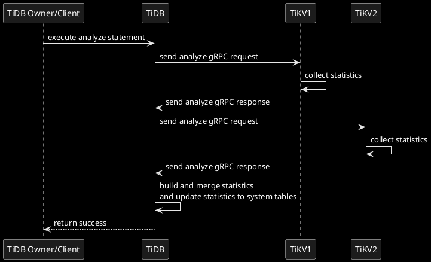

# TiDB Analyze

A Deep Dive

Based on TiDB [v7.6.0](https://github.com/pingcap/tidb/tree/v7.6.0)

RUSTIN LIU

<div class="pt-12">
  <span @click="$slidev.nav.next" class="px-2 py-1 rounded cursor-pointer" hover="bg-white bg-opacity-10">
    Begin <carbon:arrow-right class="inline"/>
  </span>
</div>


<div class="abs-br m-6 flex gap-2">
  <button @click="$slidev.nav.openInEditor()" title="Open in Editor" class="text-xl slidev-icon-btn opacity-50 !border-none !hover:text-white">
    <carbon:edit />
  </button>
  <a href="https://github.com/slidevjs/slidev" target="_blank" alt="GitHub" title="Open in GitHub"
    class="text-xl slidev-icon-btn opacity-50 !border-none !hover:text-white">
    <carbon-logo-github />
  </a>
</div>

---
transition: slide-up
---

# Rustin Liu

<div class="leading-8 opacity-80">
PingCAP Database Engineer.<br/>
Cargo/Crates.io/Rustup Maintainer.<br/>
Tokio Console Maintainer.<br/>
</div>

<div my-10 grid="~ cols-[40px_1fr] gap-y4" items-center justify-center>
  <div i-ri-github-line op50 ma text-xl/>
  <div><a href="https://github.com/hi-rustin" target="_blank">hi-rustin</a></div>
  <div i-ri-twitter-line op50 ma text-xl/>
  <div><a href="https://twitter.com/hi_rustin" target="_blank">hi_rustin</a></div>
  <div i-ri-firefox-line op50 ma text-xl/>
  <div><a href="https://hi-rustin.rs" target="_blank">hi-rustin.rs</a></div>
  <div i-ri-youtube-line op50 ma text-xl/>
  <div><a href="https://www.youtube.com/@hi-rustin" target="_blank">hi-rustin</a></div>
</div>


<div flex="~ gap2">
</div>

---
transition: slide-up
layout: center
---

<div text-6xl fw100>
  Agenda
</div>

<br>

<div class="grid grid-cols-[3fr_2fr] gap-4">
  <div class="border-l border-gray-400 border-opacity-25 !all:leading-12 !all:list-none my-auto">

  - Analyze Overview
  - Data Structure Overview
  - Data Flow Overview
  - Data Structure & Data Flow (TiKV Perspective)
  - Data Structure & Data Flow (TiDB Perspective)
  - Q&A

  </div>
</div>

---
transition: slide-left
layout: center
---

# Analyze Overview

---
transition: slide-left
layout: default
---

# Analyze Statement


---
transition: slide-left
---

# Analyze Statement


```sql
-- Analyze Tables
ANALYZE TABLE t1, t2;

-- Analyze Partitions
ANALYZE TABLE t PARTITION p1, p2;

-- Analyze Columns
ANALYZE TABLE t COLUMNS c1, c2;

-- Analyze Indexes
ANALYZE TABLE t INDEX idx1, idx2;

-- Analyze Partitions' Columns
ANALYZE TABLE t PARTITION p1 COLUMNS c1, c2;

-- Analyze Partitions' Indexes
ANALYZE TABLE t PARTITION p1 INDEX idx1, idx2;

-- Analyze Predicate Columns
ANALYZE TABLE t PREDICATE COLUMNS;

-- Analyze With Only 20 Top N
ANALYZE TABLE t COLUMNS c1, c2 WITH 20 TOPN;
```

---
transition: slide-up
---

# Data Structure Overview
A simple example.

Create table
```sql{all|2}
use test;
create table t (a int);
```
Insert 2000 rows
```ts{all|6-9}
import { Client } from "https://deno.land/x/mysql/mod.ts";

const client = await new Client().connect({...});

for (let i = 0; i < 2000; i++) {
  await client.execute(`INSERT INTO t (a) VALUES (?)`, [i]);
  if (i % 2 === 0) {
    await client.execute(`INSERT INTO t (a) VALUES (?)`, [i]);
  }
}

await client.close();
```

---
transition: slide-up
---

# Data Structure Overview
Column Selectivity

```sql
explain select * from t where a = 100;
```

| id                 | estRows                                                                              | task        | access object | operator info       |
| :----------------- | :----------------------------------------------------------------------------------- | :---------- | :------------ | :------------------ |
| TableReader\_7     | 2.00                                                                                 | root        |               | data:Selection\_6   |
| └─Selection\_6     | <span class="text-green-500" v-mark="{ color: 'green', type: 'circle' }">2.00</span> | cop\[tikv\] |               | eq\(test.t.a, 100\) |
| └─TableFullScan\_5 | 3000.00                                                                              | cop\[tikv\] | table:t       | keep order:false    |

<br/>

```go{all|2}
func equalRowCountOnColumn(encodedVal []byte...) {
  rowcount, ok := c.TopN.QueryTopN(sctx, encodedVal)
	if ok {
		return float64(rowcount), nil
	}
}
```

---
transition: slide-up
---

# Data Structure Overview
Wait for a while and then execute the analyze statement.

TopN

```sql
select * from mysql.stats_top_n order by value limit 5;
```

| table\_id | is\_index | hist\_id | value                                                                                                                                                                             | count |
| :-------- | :-------- | :------- | :-------------------------------------------------------------------------------------------------------------------------------------------------------------------------------- | :---- |
| 106       | 0         | 1        | <span class="text-green-500" v-mark="{ color: 'green', type: 'circle' }">0x038</span>00000000000<span class="text-red-500" v-mark="{ color: 'red', type: 'circle' }" >0000</span> | 2     |
| 106       | 0         | 1        | 0x038000000000000002                                                                                                                                                              | 2     |
| 106       | 0         | 1        | 0x038000000000000004                                                                                                                                                              | 2     |
| 106       | 0         | 1        | 0x038000000000000006                                                                                                                                                              | 2     |
| 106       | 0         | 1        | 0x038000000000000008                                                                                                                                                              | 2     |


---
transition: slide-up
---

# Data Structure Overview
Column Selectivity

```sql
explain select * from t where a = 1999;
```

| id                 | estRows                                                                          | task        | access object | operator info        |
| :----------------- | :------------------------------------------------------------------------------- | :---------- | :------------ | :------------------- |
| TableReader\_7     | 1.00                                                                             | root        |               | data:Selection\_6    |
| └─Selection\_6     | <span class="text-red-500" v-mark="{ color: 'red', type: 'circle' }">1.00</span> | cop\[tikv\] |               | eq\(test.t.a, 1999\) |
| └─TableFullScan\_5 | 3000.00                                                                          | cop\[tikv\] | table:t       | keep order:false     |

<br/>

```go{all|2,3,4}
func equalRowCountOnColumn(encodedVal []byte...) {
	histCnt, matched := c.Histogram.EqualRowCount(sctx, val, true)
	if matched {
		return histCnt, nil
	}
}
```

---
transition: slide-up
---

# Data Structure Overview
Column Selectivity

```sql
select hist_id, bucket_id, count, repeats,
       CAST(lower_bound AS SIGNED) AS lower_bound,
       CAST(upper_bound AS SIGNED) AS upper_bound,
       ndv
from mysql.stats_buckets order by lower_bound desc limit 5;
```

| hist\_id | bucket\_id | count                                                                         | repeats                                                                       | lower\_bound                                                                     | upper\_bound                                                                     | ndv  |
| :------- | :--------- | :---------------------------------------------------------------------------- | :---------------------------------------------------------------------------- | :------------------------------------------------------------------------------- | :------------------------------------------------------------------------------- | :--- |
| 1        | 229        | 1                                                                             | 1                                                                             | 1999                                                                             | 1999                                                                             | 0    |
| 1        | 228        | <span class="text-red-500" v-mark="{ color: 'red', type: 'circle' }">9</span> | <span class="text-red-500" v-mark="{ color: 'red', type: 'circle' }">2</span> | <span class="text-red-500" v-mark="{ color: 'red', type: 'circle' }">1993</span> | <span class="text-red-500" v-mark="{ color: 'red', type: 'circle' }">1998</span> | 0    |
| 1        | 227        | 9                                                                             | 2                                                                             | 1987                                                                             | 1992                                                                             | 0    |
| 1        | 226        | 9                                                                             | 2                                                                             | 1981                                                                             | 1986                                                                             | 0    |
| 1        | 225        | 9                                                                             | 2                                                                             | 1975                                                                             | 1980                                                                             | 0    |


---
transition: slide-up
---
# Data Structure
Histogram Bucket

- Bucket ID: The bucket ID of the histogram.
- Count: The number of rows in the bucket.
- Repeats: The number of repeated values in the bucket.
- Lower Bound: The lower bound of the bucket.
- Upper Bound: The upper bound of the bucket.
- NDV: The number of distinct values in the bucket.

````md magic-move
```json
{
    "bucket_id": 116,
    "count": 9,
    "repeats": 2,
    "lower_bound": 1321,
    "upper_bound": 1326,
    "ndv": 0
}
```


```json
{
    "bucket_id": 116,
    "count": [1321, 1322, 1322, 1323, 1323, 1324, 1324, 1325, 1326],
    "repeats": [1322, 1324],
}
```
````

---
transition: slide-up
---

# Data Structure

<Histogram/>

---
transition: slide-up
---

# Data Structure Overview
Column Selectivity

```sql
explain select * from t where a = 9999;
```

| id                 | estRows                                                                          | task        | access object | operator info        |
| :----------------- | :------------------------------------------------------------------------------- | :---------- | :------------ | :------------------- |
| TableReader\_7     | 1.33                                                                             | root        |               | data:Selection\_6    |
| └─Selection\_6     | <span class="text-red-500" v-mark="{ color: 'red', type: 'circle' }">1.33</span> | cop\[tikv\] |               | eq\(test.t.a, 2000\) |
| └─TableFullScan\_5 | 3000.00                                                                          | cop\[tikv\] | table:t       | keep order:false     |

<br/>

```go{all|2,6}
func equalRowCountOnColumn(encodedVal []byte...) {
	histNDV := float64(c.Histogram.NDV - int64(c.TopN.Num()))
	if histNDV <= 0 {
		return 0, nil
	}
	return c.Histogram.NotNullCount() / histNDV, nil
}
```

---
transition: slide-up
layout: center
---

# Data Structure Overview
Column Selectivity

- Not Null Count: The number of not null values in the column.
- NDV: The number of distinct values in the column.

How to calculate the NDV(Non-Distinct Value)?

We use [FMSketch(Flajolet-Martin Sketch)](https://en.wikipedia.org/wiki/Flajolet%E2%80%93Martin_algorithm) to calculate the NDV.


---
transition: slide-up
---

# Data Flow Overview




---
transition: slide-up
---

# Protocol Buffers - kvproto
It is similar to a SELECT statement. We send a coprocessor request to TiKV to collect statistics.

## Request

```proto{all|3,4}
message Request {
    kvrpcpb.Context context = 1;
    int64 tp = 2;
    bytes data = 3;
    uint64 start_ts = 7;
    repeated KeyRange ranges = 4;
}
```

## Response

```proto{all|2}
message Response {
    bytes data = 1;
    errorpb.Error region_error = 2;
    kvrpcpb.LockInfo locked = 3;
    string other_error = 4;
    KeyRange range = 5;
}
```

---
transition: slide-up
---

# Protocol Buffers - tipb

## Request

```proto{all|2,6}
message AnalyzeReq {
    optional AnalyzeType tp = 1;
    optional uint64 flags = 3;
    optional int64 time_zone_offset = 4;
    optional AnalyzeIndexReq idx_req = 5;
    optional AnalyzeColumnsReq col_req = 6;
}
```

```proto
message AnalyzeColumnsReq {
    optional int64 bucket_size = 1;
    optional int64 sample_size = 2;
    optional int64 sketch_size = 3;
    repeated ColumnInfo columns_info = 4;
    repeated int64 primary_column_ids = 7;
    optional int32 version = 8;
    optional double sample_rate = 11;
    ...
}
```

---
transition: slide-up
---

# Protocol Buffers - tipb

## Response

```proto
message RowSample {
    repeated bytes row = 1;
    ...
}

message RowSampleCollector {
    repeated RowSample samples = 1;
    repeated int64 null_counts = 2;
    optional int64 count = 3;
    repeated FMSketch fm_sketch = 4;
    repeated int64 total_size = 5;
}

message AnalyzeColumnsResp {
    ...
    optional Histogram pk_hist = 2;
    optional RowSampleCollector row_collector = 3;
}
```

---
transition: slide-up
layout: center
---

# Data Structure & Data Flow
TiKV Perspective

In TiKV, we only do two things:

1. Calculate the FMSketch.
2. Sample the data.


---
transition: slide-up
---

# Data Structure - FMSketch
TiKV Perspective

Mathematical Assumptions
1. **Independence of Hash Functions**:
   - Assume a good hash function **h(x)** that uniformly distributes input elements over a large range of integers.
2. **Expectation of Trailing Zeros in Hash Values**:
   - For uniformly distributed hash values, the number of trailing zeros in their binary representation follows a geometric distribution.


---
transition: slide-up
---

# Data Structure - FMSketch
TiKV Perspective

Algorithm Principles
1. **Hash Mapping**:
   - Map each element of the set to an integer using the hash function h(x).
2. **Trailing Zeros Counting**:
   - For each hash value, count the number of trailing zeros in its binary representation. Record the maximum count **R**.
3. **Cardinality Estimation**:
   - Use the maximum trailing zero count **R** to estimate the cardinality of the set with the formula $2^R$.

---
transition: slide-up
---

# Data Structure - FMSketch
TiKV Perspective

Example
- Given a set $\{a, b, c\}$
- Hash values $h(a) = 8$, $h(b) = 12$, $h(c) = 5$
- Binary representations: $1000$, $1100$, $0101$
- Trailing zeros: $3$, $2$, $0$
- Maximum trailing zeros $R = 3$
- Estimated cardinality: $2^3 = 8$


---
transition: slide-up
---

<FMSketch/>
