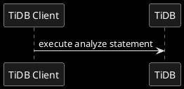

# TiDB Analyze

A Deep Dive

Based on TiDB [v7.6.0](https://github.com/pingcap/tidb/tree/v7.6.0)

RUSTIN LIU

<div class="pt-12">
  <span @click="$slidev.nav.next" class="px-2 py-1 rounded cursor-pointer" hover="bg-white bg-opacity-10">
    Begin <carbon:arrow-right class="inline"/>
  </span>
</div>


<div class="abs-br m-6 flex gap-2">
  <button @click="$slidev.nav.openInEditor()" title="Open in Editor" class="text-xl slidev-icon-btn opacity-50 !border-none !hover:text-white">
    <carbon:edit />
  </button>
  <a href="https://github.com/slidevjs/slidev" target="_blank" alt="GitHub" title="Open in GitHub"
    class="text-xl slidev-icon-btn opacity-50 !border-none !hover:text-white">
    <carbon-logo-github />
  </a>
</div>

---
transition: slide-up
---

# Rustin Liu

<div class="leading-8 opacity-80">
PingCAP Database Engineer.<br/>
Cargo Contributor.<br/>
Crates.io Maintainer.<br/>
Rustup Previous Maintainer.<br/>
</div>

<div my-10 grid="~ cols-[40px_1fr] gap-y4" items-center justify-center>
  <div i-ri-github-line op50 ma text-xl/>
  <div><a href="https://github.com/hi-rustin" target="_blank">hi-rustin</a></div>
  <div i-ri-twitter-line op50 ma text-xl/>
  <div><a href="https://twitter.com/hi_rustin" target="_blank">hi_rustin</a></div>
  <div i-ri-firefox-line op50 ma text-xl/>
  <div><a href="https://hi-rustin.rs" target="_blank">hi-rustin.rs</a></div>
  <div i-ri-youtube-line op50 ma text-xl/>
  <div><a href="https://www.youtube.com/@hi-rustin" target="_blank">hi-rustin</a></div>
</div>


<div flex="~ gap2">
</div>

---
transition: slide-up
layout: center
---

<div text-6xl fw100>
  Agenda
</div>

<br>

<div class="grid grid-cols-[3fr_2fr] gap-4">
  <div class="border-l border-gray-400 border-opacity-25 !all:leading-12 !all:list-none my-auto">

  - Analyze Overview
  - Data Structure & Data Flow (TiKV Perspective)
  - Q&A

  </div>
</div>

---
transition: slide-left
layout: center
---

# Analyze Overview

---
transition: slide-left
layout: default
---

# Analyze Statement


---
transition: slide-left
---

# Analyze Statement


```sql
-- Analyze Tables
ANALYZE TABLE t1, t2;

-- Analyze Partitions
ANALYZE TABLE t PARTITION p1, p2;

-- Analyze Columns
ANALYZE TABLE t COLUMNS c1, c2;

-- Analyze Indexes
ANALYZE TABLE t INDEX idx1, idx2;

-- Analyze Partitions' Columns
ANALYZE TABLE t PARTITION p1 COLUMNS c1, c2;

-- Analyze Partitions' Indexes
ANALYZE TABLE t PARTITION p1 INDEX idx1, idx2;

-- Analyze Predicate Columns
ANALYZE TABLE t PREDICATE COLUMNS;
```

---
transition: slide-up
---

# Data Flow

<br/>


